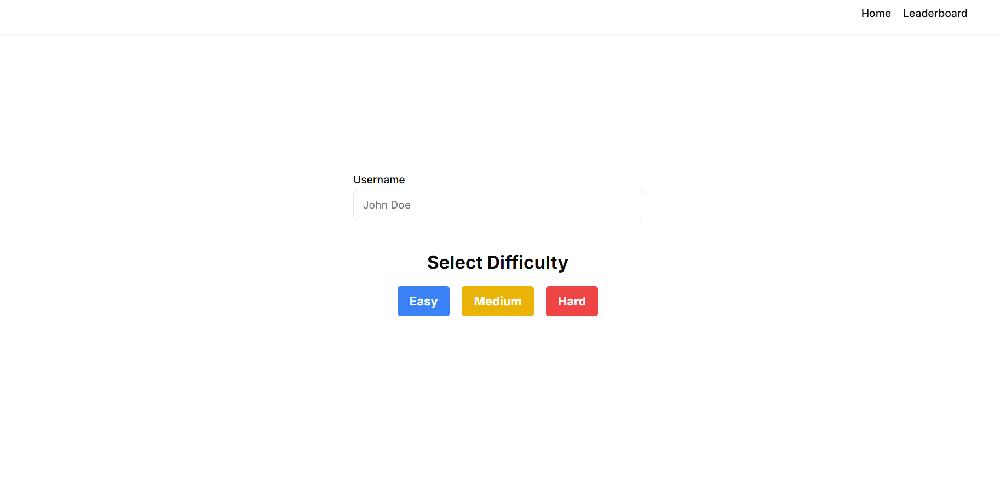
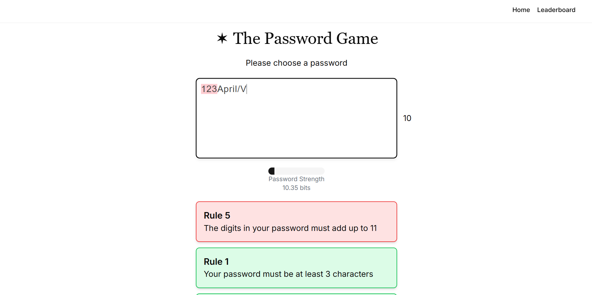
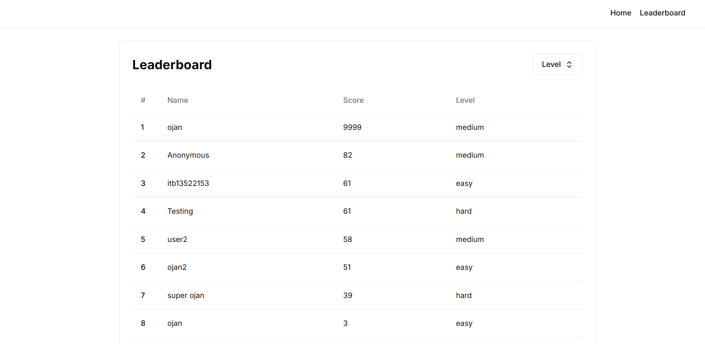

# Password Game

Password Game adalah permainan pembuatan password yang memiliki berbagai aturan yang harus dipenuhi. Aturan aturannya terkadang aneh dan sangat unik. Selain itu banyak sekali tantangan yang ada dalam menyelesaikan game ini, contoh karakter pasword yang dapat terbakar dan menyebar, ayam yang perlu dikasih makan dan captcha serta mengetahui bendera negara.

## Tech Stack
- Next.js
- ShadCn

## Struktur Program

1. Action : Berisi file yang memuat aksi yang akan dilakukan pada server side.
2. Algorithm : Berisi file yang memuat algoritma string matching yang digunakan dalam game.
3. Component : Berisi file yang memuat komponen-komponen yang digunakan dalam game.
4. Lib : Berisi file yang berisi fungsi-fungsi digunakanan untuk membantu dalam pembuatan game.
5. Prisma : Berisi file yang berisi konfigurasi database.
6. Public : Berisi Gambar-gambar yang digunakan dalam game.
7. App: berisi file yang memuat tampilan landing page dari game.
8. App/Leaderboard : Berisi file yang memuat tampilan leaderboard dari game.

## Algorithm Used
1. KMP Algorithm : Digunakan saat pattern string yang dicari hanya harus muncul sekali.
2. Booyer Moore Algorithm : Digunakan saat pattern string yang dicari dapat muncul lebih dari satu kali.
3. Regex : Digunakan saat pattern string yang dicari memiliki pola tertentu.


## How to run

1. Install Node.js
2. Lakukan instalansi package dengan menggunakan perintah berikut:
```bash
npm install
```
3. Jalankan server dengan menggunakan perintah berikut:
```bash
npm run dev
```
4. Buka browser dan akses `http://localhost:3000/`

## Screenshot

1. Landing Page

2. Game Page

3. Leaderboard Page



## References
1. [String Emoji 2 Length](https://stackoverflow.com/questions/38345372/why-does-a-string-containing-a-single-emoji-like-have-a-length-of-2)

## Pembuat
| 13522153 | Muhammad Fauzan Azhim | [LinkedIn](https://www.linkedin.com/in/fauzanazhim/) |
